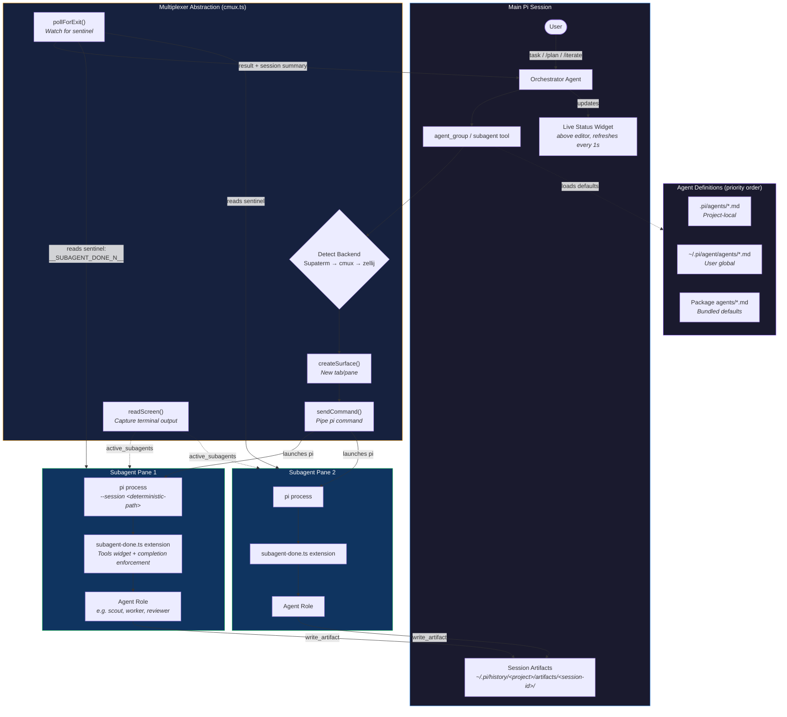
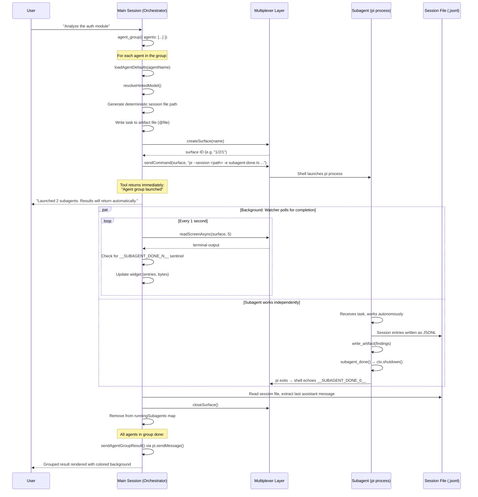
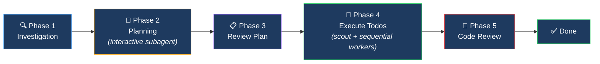

# pi-interactive-subagents

Async subagents for [pi](https://github.com/badlogic/pi-mono) — spawn, orchestrate, and manage sub-agent sessions in multiplexer panes. **Fully non-blocking** — the main agent keeps working while subagents run in the background.

https://github.com/user-attachments/assets/30adb156-cfb4-4c47-84ca-dd4aa80cba9f

## Table of Contents

- [Overview](#overview)
- [How It Works](#how-it-works)
- [Architecture](#architecture)
- [Install](#install)
- [What's Included](#whats-included)
  - [Extensions](#extensions)
  - [Bundled Agents](#bundled-agents)
- [Async Subagent Lifecycle](#async-subagent-lifecycle)
- [Spawning Subagents](#spawning-subagents)
  - [Parameters](#parameters)
  - [Orchestrator Control Tools](#orchestrator-control-tools)
- [The `/plan` Workflow](#the-plan-workflow)
- [The `/iterate` Workflow](#the-iterate-workflow)
- [Session Forking & Context Propagation](#session-forking--context-propagation)
- [Model Hints](#model-hints)
- [Custom Agents](#custom-agents)
  - [Frontmatter Reference](#frontmatter-reference)
- [Tool Access Control](#tool-access-control)
- [Role Folders](#role-folders)
- [Session Artifacts](#session-artifacts)
- [Multiplexer Status Integration](#multiplexer-status-integration)
- [Tools Widget](#tools-widget)
- [Testing](#testing)
- [Requirements](#requirements)
- [License](#license)

---

## Overview

`pi-interactive-subagents` is a pi extension package that turns a single pi coding agent into a multi-agent orchestration system. It lets a main pi session spawn specialized sub-agent sessions — each running in its own terminal multiplexer pane — without blocking the user or the main agent.

The package solves several problems at once:

- **Context isolation** — Subagents work in dedicated sessions, keeping the main session's context window clean.
- **Parallel execution** — Multiple subagents run concurrently (scouting, researching, reviewing) while the user keeps chatting.
- **Specialization** — Each agent has a defined role (scout, worker, planner, reviewer) with tailored prompts, tools, and models.
- **Automatic result steering** — When a subagent finishes, its result is steered back into the main session as an async interrupt, triggering a new turn so the orchestrator can process it.

```
╭─ Subagents ──────────────────────── 2 running ─╮
│ 00:23  Scout: Auth (scout)    8 msgs (5.1KB)   │
│ 00:45  Scout: DB (scout)     12 msgs (9.3KB)   │
╰─────────────────────────────────────────────────╯
```

---

## How It Works

Call `agent_group()` (or `subagent()` from a nested agent) and it **returns immediately**. Each sub-agent launches as a full `pi` process in its own multiplexer pane. A live widget above the input shows all running agents with elapsed time and progress. When a sub-agent finishes, its result is **steered back** into the main session as an async notification — triggering a new turn so the orchestrator can process it.

```typescript
agent_group({
  name: "Scouting",
  agents: [
    { name: "Scout: Auth", agent: "scout", task: "Analyze auth module" },
    { name: "Scout: DB", agent: "scout", task: "Map database schema" },
  ],
})
// Returns immediately → widget tracks progress → one grouped result when both finish
```

Key behaviors:

- **Non-blocking** — The main session stays fully interactive while subagents run.
- **Fire-and-forget** — Launch and wait; results steer back automatically.
- **Grouped results** — `agent_group` waits for all agents in the batch, then delivers one combined result.
- **Completion enforcement** — Autonomous subagents are required to call `write_artifact` and `subagent_done` before exiting. If they forget, the system auto-injects follow-up prompts (up to 3 retries).

---

## Architecture

The system is composed of three pi extensions, five bundled agent definitions, and a multiplexer abstraction layer that supports Supaterm, cmux, and zellij.



### Component Breakdown

| Component | File | Purpose |
|-----------|------|---------|
| **Subagents extension** | `pi-extension/subagents/index.ts` | Core orchestration — registers tools (`agent_group`, `subagent`, `active_subagents`, `subagents_list`, `branch`), commands (`/plan`, `/iterate`, `/subagent`), and message renderers for result display |
| **Multiplexer layer** | `pi-extension/subagents/cmux.ts` | Backend abstraction — detects Supaterm/cmux/zellij, creates surfaces (tabs/panes), sends commands, reads screen output, polls for exit sentinels |
| **Session utilities** | `pi-extension/subagents/session.ts` | JSONL session file manipulation — fork sanitization, entry reading, branch summaries, session merging |
| **Model hints** | `pi-extension/subagents/model-hints.ts` | Resolves `modelHint: "frontend" \| "non-frontend"` to concrete model IDs based on agent defaults and package fallbacks |
| **Subagent-done extension** | `pi-extension/subagents/subagent-done.ts` | Loaded into every subagent — provides the `subagent_done` tool, renders a tools widget (Ctrl+J), enforces completion (auto-nudges agents that forget to call `write_artifact` + `subagent_done`) |
| **Session artifacts** | `pi-extension/session-artifacts/index.ts` | `write_artifact` / `read_artifact` tools for session-scoped file storage |
| **cmux status** | `pi-extension/cmux-status/index.ts` | Pushes pi state (model, cost, tokens, idle/working) into the cmux sidebar — no-op when not in cmux |
| **Plan skill** | `pi-extension/subagents/plan-skill.md` | Multi-phase planning workflow (investigate → plan → execute → review) loaded by the `/plan` command |

### Subagent Lifecycle (Detailed)



### Result Steering Mechanism

When a subagent finishes, the result is delivered via `pi.sendMessage()` with `{ triggerTurn: true, deliverAs: "steer" }`. This:

1. Injects the result as a new message into the main session's conversation
2. Triggers a new model turn so the orchestrator agent can process the result
3. Renders the result with a colored background box (green for success, red for failure)
4. Makes it expandable with `Ctrl+O` to show the full summary and session file path

### Exit Detection

Subagents are launched with a trailing sentinel: `echo '__SUBAGENT_DONE_'$?'__'`. The watcher polls the terminal output every second using `readScreenAsync()`, looking for this pattern. When found, the exit code is extracted and the subagent is considered complete. This approach works across all multiplexer backends without requiring IPC.

---

## Install

```bash
pi install git:github.com/HazAT/pi-interactive-subagents
```

Supported multiplexers (in detection priority order):

1. **[Supaterm](https://supaterm.com)** — via `sp` CLI (`SUPATERM_SOCKET_PATH`)
2. **[cmux](https://github.com/manaflow-ai/cmux)** — via `cmux` CLI (`CMUX_SOCKET_PATH`)
3. **[zellij](https://zellij.dev)** — via `zellij` CLI (`ZELLIJ` or `ZELLIJ_SESSION_NAME`)

Start pi inside one of them:

```bash
cmux pi
# or
zellij --session pi   # then run: pi
```

Override auto-detection with:

```bash
export PI_SUBAGENT_MUX=cmux   # or supaterm, zellij
```

---

## What's Included

### Extensions

The package registers three pi extensions:

#### 1. Subagents — tools + commands

| Tool | Level | Description |
|------|-------|-------------|
| `agent_group` | main | Spawn a batch of fresh sub-agents and collect one grouped result |
| `subagent` | any | Spawn a single sub-agent in a dedicated terminal pane |
| `active_subagents` | any | List currently running subagents, optionally with recent screen output |
| `subagents_list` | any | List available agent definitions |
| `branch` | main | Fork the current session into parallel tracks with full conversation context |

| Command | Description |
|---------|-------------|
| `/plan <task>` | Start a full planning workflow (investigate → plan → execute → review) |
| `/iterate [--agent <name>] <task>` | Fork into a subagent for focused work |
| `/subagent <agent> [--hint frontend\|non-frontend] <task>` | Spawn a named agent directly |

**Depth gating:** The main session exposes `agent_group` and `branch`; `subagent` is available everywhere. `agent_group` starts fresh sessions (no prior context), while `branch` carries forward the full conversation. Prefer `branch` when accumulated context is needed.

#### 2. Session Artifacts — session-scoped file storage

| Tool | Description |
|------|-------------|
| `write_artifact` | Write plans, context, notes to `~/.pi/history/<project>/artifacts/<session-id>/` |
| `read_artifact` | Read artifacts from current or previous sessions (searches by name across all sessions) |

#### 3. cmux Status — sidebar integration

Pushes pi agent state into the cmux sidebar (no-op outside cmux):

| Status Key | Content | When Updated |
|------------|---------|--------------|
| `pi_state` | Idle / Working | `session_start`, `agent_start`, `agent_end` |
| `pi_model` | Short model name | `session_start`, `model_select` |
| `pi_thinking` | Thinking level | `session_start`, `model_select` |
| `pi_tokens` | Token count | `session_start`, `agent_end`, `turn_end` |
| `pi_cost` | Session cost ($) | `session_start`, `agent_end`, `turn_end` |
| `pi_tool` | Active tool name | `tool_execution_start`, `tool_execution_end` |

### Bundled Agents

| Agent | Model | Thinking | Role |
|-------|-------|----------|------|
| **scout** | Haiku 4.5 | — | Fast codebase reconnaissance — maps files, patterns, conventions. Read-only. |
| **worker** | Sonnet 4.6 | minimal | Implements tasks from todos — writes code, runs tests, makes polished commits. |
| **planner** | Opus 4.6 | medium | Interactive brainstorming — clarifies requirements, explores approaches, writes plans, creates todos. |
| **reviewer** | Opus 4.6 | medium | Reviews code for bugs, security issues, correctness. Read-only. |
| **visual-tester** | Sonnet 4.6 | — | Visual QA via Chrome CDP — screenshots, responsive testing, interaction testing. |

Agent discovery follows priority: **project-local** (`.pi/agents/`) > **global** (`~/.pi/agent/agents/`) > **package-bundled** (`agents/`). Override any bundled agent by placing your own version in the higher-priority location.

---

## Async Subagent Lifecycle

```
1. Orchestrator calls agent_group()    → returns immediately ("started")
2. For each agent:
   a. Load agent defaults (model, tools, thinking, deny-tools)
   b. Resolve model hints (frontend/non-frontend)
   c. Generate deterministic session file path
   d. Create multiplexer surface (tab/pane)
   e. Build pi command with --session, -e subagent-done.ts, model, tools
   f. Send command to surface
3. Widget starts refreshing (every 1s)  → shows running agents + progress
4. User keeps chatting                  → main session fully interactive
5. Watcher polls each surface           → checks for __SUBAGENT_DONE_N__ sentinel
6. Subagent finishes                    → result steered back as async interrupt
7. Orchestrator processes result         → continues with new context
```

The live widget tracks all running agents:

```
╭─ Subagents ──────────────────────── 3 running ─╮
│ 01:23  Scout: Auth (scout)      15 msgs (12KB) │
│ 00:45  Researcher (researcher)   8 msgs (6KB)  │
│ 00:12  Scout: DB (scout)             starting…  │
╰─────────────────────────────────────────────────╯
```

Completion messages render with a colored background and are expandable with `Ctrl+O`.

---

## Spawning Subagents

```typescript
// Named agent with defaults from agent definition
subagent({ name: "Scout", agent: "scout", task: "Analyze the codebase..." })

// Batch launch with one grouped completion update
agent_group({
  name: "Implementation batch",
  agents: [
    { name: "Worker: API", agent: "worker", task: "Implement the API changes" },
    { name: "Reviewer", agent: "reviewer", task: "Review the current diff" },
  ],
})

// Fork — sub-agent gets full conversation context
subagent({ name: "Iterate", fork: true, task: "Fix the bug where..." })

// Typed fork — keep full conversation context but adopt a named agent role
subagent({ name: "Debugger", agent: "debugger", fork: true, task: "Reproduce the flaky test" })

// Override agent defaults
subagent({ name: "Worker", agent: "worker", model: "anthropic/claude-opus-4-7", task: "Quick fix..." })

// Hint the model family without hardcoding a specific model
subagent({ name: "Worker", agent: "worker", modelHint: "frontend", task: "Polish the pricing page UI" })
subagent({ name: "Worker", agent: "worker", modelHint: "non-frontend", task: "Refactor the queue worker" })

// Custom working directory — picks up local .pi/ config, CLAUDE.md, etc.
subagent({ name: "Designer", agent: "game-designer", cwd: "agents/game-designer", task: "..." })
```

### Parameters

| Parameter | Type | Default | Description |
|-----------|------|---------|-------------|
| `name` | string | required | Display name (shown in widget and pane title) |
| `task` | string | required | Task prompt for the sub-agent |
| `agent` | string | — | Load defaults from agent definition file |
| `fork` | boolean | `false` | Copy current session for full context. When combined with `agent`, creates a typed fork: current context + named agent role |
| `model` | string | — | Override agent's default model (e.g. `anthropic/claude-opus-4-7`) |
| `modelHint` | `"frontend"` \| `"non-frontend"` | — | Hint the model family. `frontend` prefers Claude; `non-frontend` prefers Codex/GPT. Ignored when `model` is set |
| `systemPrompt` | string | — | Append to system prompt |
| `skills` | string | — | Comma-separated skill names to auto-load |
| `tools` | string | — | Comma-separated native pi tools: `read`, `bash`, `edit`, `write`, `grep`, `find`, `ls` |
| `cwd` | string | — | Working directory for the sub-agent (see [Role Folders](#role-folders)) |

### Orchestrator Control Tools

These are for the **outer/orchestrator session** to supervise active work:

```typescript
// List running agents with optional screen capture
active_subagents({ screenLines: 40 })

```

Subagents with `spawning: false` have orchestration tools denied by default.

---

## The `/plan` Workflow

The `/plan` command orchestrates a full planning-to-implementation pipeline:

```
/plan Add a dark mode toggle to the settings page
```



| Phase | What Happens | Tab Title |
|-------|-------------|-----------|
| 1. Investigation | Quick codebase scan (optionally spawns a scout) | `🔍 Investigating: dark mode` |
| 2. Planning | Interactive planner subagent — user collaborates in the pane | `💬 Planning: dark mode` |
| 3. Review Plan | Confirm todos, adjust if needed | `📋 Review: dark mode` |
| 4. Execute | Scout gathers context, then workers implement todos **sequentially** | `🔨 Executing: 1/3` |
| 5. Review | Reviewer subagent checks all changes, findings triaged by priority | `🔎 Reviewing` → `✅ Done` |

Workers execute sequentially to avoid git conflicts. The planner phase is **interactive** — the user works directly with the planner subagent through the multiplexer pane.

---

## The `/iterate` Workflow

For quick, focused work without polluting the main session's context:

```
/iterate Fix the off-by-one error in the pagination logic
/iterate --agent debugger Reproduce and fix the off-by-one error
```

This forks the current session into a subagent with full conversation context. Without `--agent`, it's a raw self-fork. With `--agent`, it creates a **typed fork**: the child keeps the full conversation but adopts that agent's role, model, tools, and constraints.

---

## Session Forking & Context Propagation

When `fork: true` is set, the system creates a sanitized copy of the parent session for the child:

```mermaid
flowchart LR
    subgraph Parent["Parent Session (session.jsonl)"]
        P1["session header"]
        P2["user msg 1"]
        P3["assistant msg 1<br/><i>(text + toolCalls)</i>"]
        P4["toolResult<br/><i>(bash output)</i>"]
        P5["assistant msg 2"]
        P6["user msg: 'spawn subagent'"]
    end

    subgraph Sanitizer["writeSanitizedForkSession()"]
        S1["Drop triggering user message"]
        S2["Strip thinking blocks"]
        S3["Truncate tool results<br/><i>(16 lines / 1200 chars)</i>"]
        S4["Omit noisy tool outputs<br/><i>(active_subagents, etc.)</i>"]
        S5["Preserve toolCall stubs<br/><i>(id + name only)</i>"]
    end

    subgraph Child["Fork Session"]
        C1["session header"]
        C2["user msg 1"]
        C3["assistant msg 1<br/><i>(text + toolCall stubs)</i>"]
        C4["toolResult<br/><i>(truncated)</i>"]
        C5["assistant msg 2"]
    end

    Parent --> Sanitizer --> Child

    style Parent fill:#1a1a2e,stroke:#4da6ff,color:#fff
    style Sanitizer fill:#16213e,stroke:#f59e0b,color:#fff
    style Child fill:#0f3460,stroke:#22c55e,color:#fff
```



The sanitizer (`session.ts:writeSanitizedForkSession`) ensures:

- The triggering user message (e.g. "spawn a subagent") is dropped so the child doesn't see the meta-request
- Assistant messages keep text blocks and toolCall **stubs** (id + name only, no arguments) — providers require every `tool_result` to match a `tool_use` in the preceding assistant message
- Tool results from noisy tools (`active_subagents`, `subagent`, `agent_group`, etc.) are replaced with `[tool output omitted]`
- Regular tool output is truncated to 16 lines / 1200 chars to keep context compact
- Thinking blocks and signatures are stripped
- Session metadata fields (`usage`, `model`, `timestamp`) are preserved for replay
- Forked runs append the follow-up task directly into the sanitized child session as a normal user turn
- Non-forked runs launch the follow-up task via `@file` to avoid shell quoting and argv-length issues

---

## Model Hints

Model hints let you steer subagents toward the right model family without hardcoding specific model IDs:

```typescript
// Frontend work → prefers Claude/Sonnet/Opus family
subagent({ name: "UI Worker", agent: "worker", modelHint: "frontend", task: "..." })

// Backend work → prefers Codex/GPT family
subagent({ name: "API Worker", agent: "worker", modelHint: "non-frontend", task: "..." })
```

Resolution order (`model-hints.ts:resolveHintedModel`):

1. **Explicit `model`** → always wins, hint is informational only
2. **Agent `model-frontend` / `model-non-frontend` frontmatter** → hint-specific override
3. **Agent default `model`** → used if it already matches the hinted family
4. **Package defaults** → `anthropic/claude-sonnet-4-7` (frontend) or `openai-codex/gpt-5.4` (non-frontend)

Accepted aliases: `frontend`, `ui`, `ux`, `design` → `"frontend"` | `non-frontend`, `backend`, `general`, `code`, `coding` → `"non-frontend"`

---

## Custom Agents

Place a `.md` file in `.pi/agents/` (project) or `~/.pi/agent/agents/` (global):

```markdown
---
name: my-agent
description: Does something specific
model: anthropic/claude-sonnet-4-7
thinking: minimal
tools: read, bash, edit, write
spawning: false
---

# My Agent

You are a specialized agent that does X...
```

The frontmatter configures the agent's defaults. Everything after the `---` fence is the agent's system prompt body — it gets injected into the task message when the agent is spawned.

### Frontmatter Reference

| Field | Type | Description |
|-------|------|-------------|
| `name` | string | Agent name (used in `agent: "my-agent"`) |
| `description` | string | Shown in `subagents_list` output |
| `model` | string | Default model (e.g. `anthropic/claude-sonnet-4-7`) |
| `model-frontend` / `frontend-model` | string | Model override when `modelHint: "frontend"` |
| `model-non-frontend` / `non-frontend-model` | string | Model override when `modelHint: "non-frontend"` |
| `thinking` | string | Thinking level: `minimal`, `medium`, `high` |
| `tools` | string | Comma-separated **native pi tools only**: `read`, `bash`, `edit`, `write`, `grep`, `find`, `ls` |
| `skills` | string | Comma-separated skill names to auto-load |
| `spawning` | boolean | Set `false` to deny all subagent-spawning tools |
| `deny-tools` | string | Comma-separated extension tool names to deny |
| `cwd` | string | Default working directory (absolute or relative to project root) |

---

## Tool Access Control

Control what tools subagents can access:

### `spawning: false`

Denies all spawning-related tools (`subagent`, `agent_group`, `branch`, `subagents_list`, `active_subagents`):

```yaml
---
name: worker
spawning: false
---
```

### `deny-tools`

Fine-grained control over individual extension tools:

```yaml
---
name: focused-agent
deny-tools: subagent, active_subagents
---
```

Both mechanisms work through the `PI_DENY_TOOLS` environment variable — the parent sets it when launching the child, and the subagent-done extension reads it to filter tool registration.

### Recommended Configuration

| Agent | `spawning` | Rationale |
|-------|-----------|-----------|
| planner | *(default/true)* | Legitimately spawns scouts for investigation |
| worker | `false` | Should implement tasks, not delegate |
| researcher | `false` | Should research, not spawn |
| reviewer | `false` | Should review, not spawn |
| scout | `false` | Should gather context, not spawn |

---

## Role Folders

The `cwd` parameter lets sub-agents start in a specific directory with its own configuration:

```
project/
├── agents/
│   ├── game-designer/
│   │   └── CLAUDE.md          ← "You are a game designer..."
│   ├── sre/
│   │   ├── CLAUDE.md          ← "You are an SRE specialist..."
│   │   └── .pi/skills/        ← SRE-specific skills
│   └── narrative/
│       └── CLAUDE.md          ← "You are a narrative designer..."
```

```typescript
subagent({ name: "Game Designer", cwd: "agents/game-designer", task: "Design the combat system" })
subagent({ name: "SRE", cwd: "agents/sre", task: "Review deployment pipeline" })
```

When `cwd` is set, the pi process starts in that directory and automatically picks up its local `.pi/` config, `CLAUDE.md`, skills, and extensions. Set a default `cwd` in agent frontmatter:

```yaml
---
name: game-designer
cwd: ./agents/game-designer
spawning: false
---
```

---

## Session Artifacts

Subagents communicate structured output through session-scoped artifact files:

```
~/.pi/history/<project>/artifacts/<session-id>/
├── context.md                    ← scout findings
├── plans/
│   └── 2026-04-12-dark-mode.md  ← planner output
├── review.md                     ← reviewer report
└── visual-test-report.md         ← visual tester report
```

- **`write_artifact`** — Agents write their deliverables here instead of to the project directory
- **`read_artifact`** — Searches the current session first, then other sessions for the same project (most recently modified first)

This keeps agent working files separate from the project codebase while making them accessible across sessions.

---

## Multiplexer Status Integration

When running inside cmux, the cmux-status extension pushes real-time agent state into the sidebar using `cmux set-status`:

```
┌─────────────────┐
│ ✓ Idle          │  ← pi_state (green when idle, amber when working)
│ 🧠 sonnet-4-7   │  ← pi_model
│ ✨ minimal       │  ← pi_thinking
│ 📊 45.2k tokens │  ← pi_tokens
│ 💰 $0.23        │  ← pi_cost
│ 🔧 bash         │  ← pi_tool (shown during tool execution)
└─────────────────┘
```

The extension hooks into pi lifecycle events (`session_start`, `agent_start`, `agent_end`, `turn_end`, `model_select`, `tool_execution_start/end`) and fires fire-and-forget `cmux` CLI calls. Errors are silently ignored so cmux issues never affect pi.

---

## Tools Widget

Every sub-agent session displays a compact tools widget showing available and denied tools. Toggle with `Ctrl+J`:

```
[scout] — 12 tools · 4 denied  (Ctrl+J)              ← collapsed
[scout] — 12 available  (Ctrl+J to collapse)          ← expanded
  read, bash, edit, write, todo, ...
  denied: subagent, subagents_list, ...
```

---

## Testing

The test suite covers the non-multiplexer-dependent logic:

```bash
node --test test/test.ts
```

Tested modules:
- **`session.ts`** — `getLeafId`, `getEntryCount`, `getNewEntries`, `findLastAssistantMessage`, `appendBranchSummary`, `copySessionFile`, `mergeNewEntries`, `writeSanitizedForkSession`
- **`model-hints.ts`** — `normalizeModelHint`, `modelMatchesHintFamily`, `resolveHintedModel`
- **`cmux.ts`** — `shellEscape`, `isCmuxAvailable`

---

## Requirements

- [pi](https://github.com/badlogic/pi-mono) — the coding agent
- One supported multiplexer:
  - [Supaterm](https://supaterm.com) (preferred — native tab management)
  - [cmux](https://github.com/manaflow-ai/cmux)
  - [zellij](https://zellij.dev)

```bash
cmux pi
# or
zellij --session pi   # then run: pi
```

Optional backend override:

```bash
export PI_SUBAGENT_MUX=cmux   # or supaterm, zellij
```

## License

MIT
